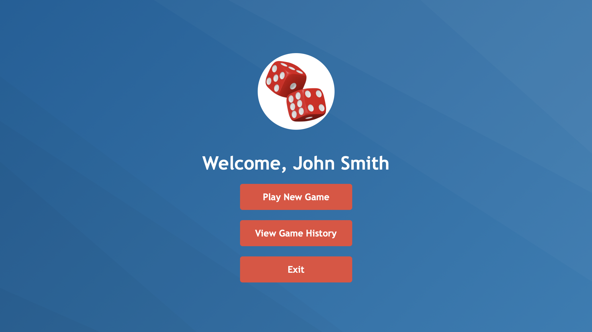

# 🎲 Drop Dead Dice

A full-stack application to display and run the Drop Dead dice game. Built with Ruby on Rails, MySQL, and hosted on AWS, it delivers a fun and interactive gaming experience along with detailed game stats.

## 🚀 Features

- **Interactive Gameplay**: Enjoy the Drop Dead dice game with a sleek and responsive UI.
- **Score & History Tracking**: Automatically record and display game scores and history.
- **User Authentication**: Secure sign-up and login to keep track of your progress.
- **Real-Time Updates**: Instant game results and dynamic score updates.
- **Responsive Design**: Optimized for desktop and mobile devices.

## 💻 Technologies Used

- **Backend:** Ruby on Rails
- **Database:** MySQL
- **Cloud Hosting:** AWS
- **Frontend:** Integrated Rails views enhanced with modern JavaScript and CSS

## 🎥 App Preview



## 🔨 Set-Up

1. Clone the repository:  
   ```sh
   git clone https://github.com/rithik-c/Drop-Dead-Game
   ```  
2. Navigate to the project directory:  
   ```sh
   cd Drop-Dead-Game
   ```  
3. Install dependencies:  
   ```sh
   bundle install
   ```  
4. Set up the database:  
   ```sh
   rails db:create
   rails db:migrate
   ```  
5. Start the Rails server:  
   ```sh
   rails server
   ```
6. Open your browser and navigate to http://localhost:3000 to start playing.

## 💡 Contributing  

Contributions are welcome! Fork the repository and submit a pull request with your improvements.  

## 📄 License  

Drop Dead Dice is available under the MIT license.
